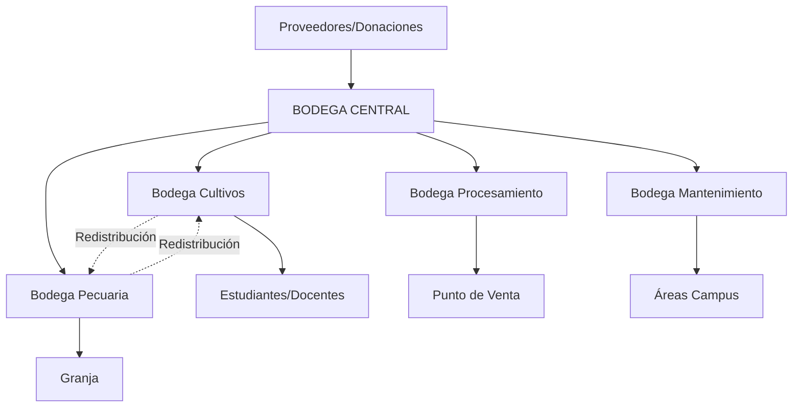

# 🎓 Demo Sistema de Bodega - Escuela Nacional de Agricultura (ENA)

## 📍 Contexto de la Institución

**Escuela Nacional de Agricultura "Roberto Quiñónez"**
- **Ubicación:** Santa Tecla, La Libertad, El Salvador
- **Tipo:** Institución educativa agrícola del Ministerio de Agricultura y Ganadería (MAG)
- **Actividades:** Educación técnica agrícola, producción agrícola, ganadería, procesamiento de alimentos

---

## 🏢 Estructura de Bodegas de la ENA

### **BODEGA GENERAL (Principal)**

```
📦 BODEGA CENTRAL - Almacén General ENA
Ubicación: Edificio Administrativo, Campus Central, Santa Tecla
Código: ENA-BG-001
Capacidad: 500 m³
Responsable: Jefe de Almacén General
```

**Función:**
- Recibe todas las compras de proveedores
- Recibe donaciones de organismos internacionales
- Almacena productos en cantidades grandes
- Distribuye a las bodegas fraccionarias según necesidad

**Productos que maneja:**
- Insumos agrícolas (fertilizantes, semillas, agroquímicos)
- Herramientas y equipos
- Materiales de construcción y mantenimiento
- Alimentos para ganado (concentrados, sales minerales)
- Materiales educativos y de laboratorio
- Productos de limpieza y mantenimiento
- Equipo de protección personal (EPP)

---

### **BODEGAS FRACCIONARIAS** (Satélites)

#### 🌾 **1. Bodega Fraccionaria - Área de Cultivos**
```
Ubicación: Parcelas de Cultivo, Campus ENA
Código: ENA-BF-CULTIVOS
Capacidad: 80 m³
Responsable: Coordinador de Cultivos
```

**Función:**
- Recibe insumos agrícolas fraccionados desde Bodega Central
- Despacha insumos a estudiantes y docentes para prácticas
- Abastece las parcelas demostrativas

**Productos típicos:**
- Fertilizantes (sacos divididos en porciones)
- Semillas (por cultivo específico)
- Agroquímicos (cantidades controladas)
- Herramientas manuales
- EPP para trabajo de campo

---

#### 🐄 **2. Bodega Fraccionaria - Unidad Pecuaria**
```
Ubicación: Granja de Ganado, Campus ENA
Código: ENA-BF-PECUARIA
Capacidad: 60 m³
Responsable: Coordinador de Ganadería
```

**Función:**
- Recibe alimentos y medicamentos para animales
- Despacha raciones diarias para ganado bovino, porcino, avícola
- Control de inventario de productos veterinarios

**Productos típicos:**
- Concentrados para ganado (sacos fraccionados)
- Sales minerales
- Medicamentos veterinarios
- Suplementos alimenticios
- Material de limpieza de establos

---

#### 🍞 **3. Bodega Fraccionaria - Planta de Procesamiento**
```
Ubicación: Planta Agroindustrial, Campus ENA
Código: ENA-BF-PROCESO
Capacidad: 50 m³
Responsable: Coordinador de Agroindustria
```

**Función:**
- Recibe insumos para procesamiento de alimentos
- Almacena productos procesados listos para venta
- Despacha productos al punto de venta institucional

**Productos típicos:**
- Ingredientes (azúcar, sal, conservantes)
- Material de empaque
- Productos terminados (mermeladas, jaleas, lácteos)
- Insumos de panadería
- Material de etiquetado

---

#### 🔧 **4. Bodega Fraccionaria - Mantenimiento**
```
Ubicación: Taller de Mantenimiento, Campus ENA
Código: ENA-BF-MANT
Capacidad: 40 m³
Responsable: Jefe de Mantenimiento
```

**Función:**
- Recibe herramientas y repuestos
- Despacha materiales para reparaciones
- Controla inventario de equipos y maquinaria menor

**Productos típicos:**
- Herramientas eléctricas y manuales
- Repuestos de maquinaria agrícola
- Materiales de construcción
- Pintura y materiales de acabado
- Combustibles y lubricantes

---

## 🔄 Flujo Operativo Típico de la ENA

### **Flujo General:**



---

## 📋 Escenarios de Demo Sugeridos

### **ESCENARIO 1: Compra e Ingreso a Bodega Central**

**Contexto:** La ENA recibe una compra de fertilizantes del proveedor DISAGRO

**Flujo:**
1. **Módulo:** Compras
2. **Acción:** Crear orden de compra
   - Proveedor: DISAGRO S.A. de C.V.
   - Producto: Fertilizante NPK 15-15-15 (50 sacos de 50 lb)
   - Destino: Bodega Central ENA-BG-001
   - Valor total: $1,250.00
3. **Acción:** Recibir compra
   - Estado: Pendiente → Aprobado → Recibido
   - Ingreso a inventario de Bodega Central
4. **Resultado:** Stock actualizado en Bodega Central

---

### **ESCENARIO 2: Traslado de Bodega Central a Bodega Fraccionaria**

**Contexto:** El área de cultivos solicita fertilizantes para prácticas del mes

**Flujo:**
1. **Módulo:** Traslados
2. **Acción:** Crear traslado interno
   - Origen: Bodega Central (ENA-BG-001)
   - Destino: Bodega Cultivos (ENA-BF-CULTIVOS)
   - Producto: Fertilizante NPK 15-15-15 (10 sacos)
   - Razón: "Abastecimiento mensual para prácticas de cultivo"
   - Solicitante: Coordinador de Cultivos
3. **Acción:** Aprobar traslado
   - Aprobador: Jefe de Almacén General
4. **Acción:** Despachar traslado
   - Estado: Pendiente → Aprobado → En Tránsito
   - Movimiento de salida en Bodega Central
5. **Acción:** Recibir en Bodega Fraccionaria
   - Estado: En Tránsito → Recibido
   - Movimiento de entrada en Bodega Cultivos
   - Verificación de cantidades
6. **Resultado:**
   - Bodega Central: -10 sacos (40 restantes)
   - Bodega Cultivos: +10 sacos

---

### **ESCENARIO 3: Despacho Interno desde Bodega Fraccionaria**

**Contexto:** Estudiantes de 2° año necesitan fertilizante para práctica en parcela #3

**Flujo:**
1. **Módulo:** Despachos
2. **Acción:** Crear despacho interno
   - Bodega: Bodega Cultivos (ENA-BF-CULTIVOS)
   - Tipo: Despacho Interno
   - Producto: Fertilizante NPK 15-15-15 (2 sacos)
   - Destinatario: Práctica 2° Año - Ing. José Martínez (docente)
   - Proyecto/Área: Parcela Demostrativa #3
   - Documento: Requisición EDU-2024-0023
3. **Acción:** Aprobar y procesar despacho
   - Estado: Borrador → Pendiente → Aprobado → Despachado → Entregado
   - Firma de recibido: Ing. José Martínez
4. **Resultado:**
   - Bodega Cultivos: -2 sacos (8 restantes)
   - Registro en Kardex del producto
   - Trazabilidad: De proveedor hasta parcela específica

---

### **ESCENARIO 4: Traslado entre Bodegas Fraccionarias**

**Contexto:** La Bodega de Cultivos tiene exceso de herramientas que necesita Mantenimiento

**Flujo:**
1. **Módulo:** Traslados
2. **Acción:** Crear traslado entre fraccionarias
   - Origen: Bodega Cultivos (ENA-BF-CULTIVOS)
   - Destino: Bodega Mantenimiento (ENA-BF-MANT)
   - Producto: Palas de punta (5 unidades)
   - Razón: "Redistribución de herramientas por exceso en área agrícola"
3. **Acción:** Aprobar y ejecutar traslado
   - Aprobación del Coordinador de Cultivos
   - Recepción en Bodega Mantenimiento
4. **Resultado:** Redistribución eficiente entre áreas

---

### **ESCENARIO 5: Recepción de Donación**

**Contexto:** FAO dona semillas de maíz mejorado a la ENA

**Flujo:**
1. **Módulo:** Donaciones
2. **Acción:** Registrar donación
   - Donante: FAO (Organización de las Naciones Unidas para la Alimentación y la Agricultura)
   - Producto: Semilla de Maíz Híbrido H-59 (200 kg)
   - Valor estimado: $1,800.00
   - Proyecto: "Fortalecimiento Educación Agrícola 2024"
   - Documento: Acta de Donación FAO-ENA-2024-05
   - Destino: Bodega Central
3. **Acción:** Aprobar y recibir donación
   - Estado: Borrador → Pendiente → Aprobado → Recibido
   - Generar comprobante de recepción
4. **Resultado:** Stock de semillas en Bodega Central

---

### **ESCENARIO 6: Consulta de Stock en Tiempo Real**

**Contexto:** El Coordinador Pecuario necesita saber si hay concentrado disponible

**Flujo:**
1. **Módulo:** Consultas → Stock en Tiempo Real
2. **Acción:** Buscar producto
   - Producto: "Concentrado para Ganado Bovino"
   - Filtros: Todas las bodegas
3. **Resultado:** Vista consolidada
   ```
   Bodega Central: 45 sacos
   Bodega Pecuaria: 8 sacos
   Total ENA: 53 sacos
   Estado: Stock Normal
   ```

---

### **ESCENARIO 7: Reporte Kardex**

**Contexto:** Auditoría interna solicita movimientos del mes

**Flujo:**
1. **Módulo:** Reportes → Kardex
2. **Acción:** Generar reporte
   - Producto: Fertilizante NPK 15-15-15
   - Bodega: Bodega Central
   - Período: Noviembre 2024
3. **Resultado:** Reporte PDF/Excel con:
   ```
   Fecha       | Tipo        | Documento      | Entrada | Salida | Saldo
   01/11/2024  | Compra      | COM-2024-1234  | 50      | -      | 50
   05/11/2024  | Traslado    | TRF-2024-5678  | -       | 10     | 40
   12/11/2024  | Traslado    | TRF-2024-5690  | -       | 15     | 25
   ```

---

### **ESCENARIO 8: Alertas de Stock Bajo**

**Contexto:** Sistema detecta productos críticos

**Flujo:**
1. **Módulo:** Dashboard → Alertas
2. **Sistema automático:** Detecta productos bajo mínimo
3. **Resultado:** Notificaciones
   ```
   🔴 Stock Crítico
   - Concentrado Ganado Bovino: 8 sacos (Mínimo: 15 sacos)
   - Fertilizante Urea: 5 sacos (Mínimo: 10 sacos)

   📧 Email enviado a: Jefe de Almacén General
   ```

---

### **ESCENARIO 9: Cierre Mensual de Inventario**

**Contexto:** Fin de mes, se debe cerrar inventario de cada bodega

**Flujo:**
1. **Módulo:** Cierres de Inventario
2. **Acción:** Iniciar cierre mensual
   - Período: Noviembre 2024
   - Bodega: Bodega Cultivos
3. **Proceso automático:**
   - Calcular saldo inicial
   - Sumar todas las entradas del mes
   - Restar todas las salidas del mes
   - Calcular saldo final teórico
4. **Acción:** Contar físicamente inventario
   - Ingresar conteo real
   - Comparar con saldo teórico
   - Registrar diferencias (si existen)
5. **Acción:** Aprobar y cerrar período
   - Estado: En Proceso → Aprobado → Cerrado
   - Generar reporte de cierre
6. **Resultado:** Mes bloqueado para ediciones, inventario consolidado

---

### **ESCENARIO 10: Ajuste de Inventario**

**Contexto:** Durante conteo físico se detecta merma por producto vencido

**Flujo:**
1. **Módulo:** Ajustes de Inventario
2. **Acción:** Crear ajuste
   - Bodega: Bodega Procesamiento
   - Tipo: Negativo - Pérdida por vencimiento
   - Producto: Levadura para panadería (2 kg)
   - Razón: "Producto vencido detectado en conteo físico"
   - Documento soporte: Acta de Destrucción #123
   - Costo unitario: $12.00
   - Valor total: $24.00
3. **Acción:** Aprobar ajuste
   - Aprobador: Jefe de Almacén General
   - Justificación revisada y aprobada
4. **Resultado:**
   - Stock ajustado: -2 kg
   - Movimiento registrado en Kardex
   - Valor contabilizado como pérdida

---

## 👥 Roles de Usuario para la Demo

### **1. Super Admin**
- Usuario: `admin@ena.gob.sv`
- Acceso: Total al sistema
- Puede: Ver todas las bodegas, aprobar todo, generar reportes globales

### **2. Jefe de Almacén General**
- Usuario: `almacen.general@ena.gob.sv`
- Acceso: Bodega Central y supervisión de todas las fraccionarias
- Puede: Aprobar traslados, compras, donaciones, ajustes

### **3. Coordinador de Cultivos**
- Usuario: `cultivos@ena.gob.sv`
- Acceso: Solo Bodega Fraccionaria de Cultivos
- Puede: Solicitar traslados, crear despachos internos, consultar stock

### **4. Coordinador Pecuario**
- Usuario: `pecuaria@ena.gob.sv`
- Acceso: Solo Bodega Fraccionaria Pecuaria
- Puede: Solicitar traslados, crear despachos, consultar stock

### **5. Coordinador de Procesamiento**
- Usuario: `procesamiento@ena.gob.sv`
- Acceso: Solo Bodega Fraccionaria de Procesamiento
- Puede: Solicitar traslados, despachar productos terminados

### **6. Jefe de Mantenimiento**
- Usuario: `mantenimiento@ena.gob.sv`
- Acceso: Solo Bodega Fraccionaria de Mantenimiento
- Puede: Solicitar traslados, despachar herramientas y repuestos

---

## 📦 Productos de Ejemplo para la Demo

### **Categoría: Insumos Agrícolas**
1. Fertilizante NPK 15-15-15 (sacos 50 lb)
2. Fertilizante Urea 46% (sacos 50 lb)
3. Semilla Maíz Híbrido H-59 (kg)
4. Semilla Frijol Rojo (kg)
5. Insecticida Cipermetrina (litros)
6. Herbicida Glifosato (litros)
7. Fungicida Mancozeb (kg)

### **Categoría: Alimentos para Ganado**
1. Concentrado Ganado Bovino (sacos 100 lb)
2. Concentrado Ganado Porcino (sacos 100 lb)
3. Concentrado Avícola Ponedoras (sacos 100 lb)
4. Sales Minerales (bloques 5 kg)
5. Melaza (galones)

### **Categoría: Herramientas**
1. Palas de punta (unidades)
2. Azadones (unidades)
3. Machetes (unidades)
4. Rastrillos (unidades)
5. Tijeras de podar (unidades)

### **Categoría: Procesamiento**
1. Azúcar blanca (quintales)
2. Sal común (kg)
3. Conservantes (kg)
4. Envases de vidrio 250ml (unidades)
5. Etiquetas adhesivas (rollos)
6. Levadura fresca (kg)

### **Categoría: Mantenimiento**
1. Pintura látex blanco (galones)
2. Cemento gris (sacos 42.5 kg)
3. Clavos 3" (libras)
4. Aceite motor 15W40 (galones)
5. Candados de seguridad (unidades)

---

## 📊 KPIs y Métricas para Mostrar en Demo

### **Dashboard Principal:**
```
📦 Inventario Total: $45,250.00
🏢 Bodegas Activas: 5 (1 General + 4 Fraccionarias)
📋 Productos Registrados: 85
🔴 Alertas Activas: 3 productos bajo mínimo
📥 Movimientos del Mes: 127 transacciones
```

### **Bodega Central:**
```
📊 Capacidad Utilizada: 340 m³ / 500 m³ (68%)
💰 Valor Inventario: $32,100.00
📦 Productos: 65 SKUs
🔄 Traslados Enviados (mes): 23
```

### **Bodega Cultivos:**
```
📊 Capacidad Utilizada: 58 m³ / 80 m³ (72.5%)
💰 Valor Inventario: $6,800.00
📦 Productos: 28 SKUs
🔄 Despachos Internos (mes): 34
```

---

## 🎯 Objetivos de la Demo

1. ✅ Demostrar **jerarquía clara** entre Bodega General y Fraccionarias
2. ✅ Mostrar **flujo completo**: Compra → Traslado → Despacho Interno
3. ✅ Evidenciar **control de inventario** en tiempo real
4. ✅ Mostrar **trazabilidad completa** (de proveedor hasta usuario final)
5. ✅ Demostrar **reportes y Kardex** para auditorías
6. ✅ Mostrar **alertas automáticas** de stock bajo
7. ✅ Evidenciar **cierres mensuales** y control de períodos
8. ✅ Mostrar **roles y permisos** diferenciados por usuario

---

## 🚀 Preparación Técnica Requerida

### **Base de Datos:**
1. ✅ Crear empresa única: "Escuela Nacional de Agricultura"
2. ✅ Crear sucursal única: "Campus Central Santa Tecla"
3. ✅ Crear 5 bodegas (1 general + 4 fraccionarias)
4. ✅ Crear 85 productos en diferentes categorías
5. ✅ Crear 6 usuarios con roles diferenciados
6. ✅ Cargar inventario inicial en todas las bodegas
7. ✅ Crear movimientos históricos (último mes)
8. ✅ Generar alertas de ejemplo

### **Configuración:**
1. ✅ Logo de la ENA en el sistema
2. ✅ Configuración de moneda: USD
3. ✅ Configuración regional: El Salvador
4. ✅ Umbrales de stock mínimo configurados
5. ✅ Notificaciones por email habilitadas

---

## 📅 Secuencia Recomendada para Presentación

### **PARTE 1: Introducción (5 min)**
- Mostrar dashboard principal
- Explicar estructura de bodegas ENA
- Mostrar mapa/ubicaciones de bodegas

### **PARTE 2: Operaciones Diarias (15 min)**
- Escenario 1: Crear compra e ingresar a Bodega Central
- Escenario 2: Traslado a Bodega Fraccionaria
- Escenario 3: Despacho interno a estudiantes

### **PARTE 3: Consultas y Reportes (10 min)**
- Escenario 6: Consulta de stock en tiempo real
- Escenario 7: Reporte Kardex
- Mostrar alertas de stock bajo

### **PARTE 4: Controles Administrativos (10 min)**
- Escenario 9: Cierre mensual
- Escenario 10: Ajuste de inventario
- Mostrar trazabilidad completa de un producto

### **PARTE 5: Preguntas y Respuestas (10 min)**

---

## ✨ Ventajas Específicas para la ENA

1. **Control de Recursos Públicos:** Trazabilidad completa para auditorías del MAG
2. **Distribución Eficiente:** Abastecimiento ágil a áreas educativas
3. **Control de Donaciones:** Registro formal de donaciones internacionales
4. **Reducción de Pérdidas:** Alertas de vencimiento y stock bajo
5. **Reportería para Gobierno:** Reportes automáticos para rendición de cuentas
6. **Multi-usuario:** Cada coordinador maneja su bodega independientemente
7. **Trazabilidad Educativa:** Seguimiento de insumos usados en prácticas estudiantiles

---

**Fecha de Preparación:** 20 de Noviembre, 2024
**Versión:** 1.0
**Preparado para:** Dirección ENA y Equipo Técnico MAG
