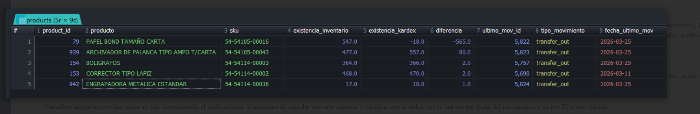

# Problema con el Kardex - Sistema Bodega

## Descripción del Problema

Quiero comentarle que he tenido inconvenientes con el Kardex del sistema Bodega. Para el mes de febrero teníamos Kardex con saldos erróneos, esto fue identificado y comparado con las existencias actuales que mostraba en el inventario. Se identificaron varios productos, pero fui revisando uno por uno y logré cuadrar los Kardex en ese momento.

Ahora que estamos iniciando a ingresar el mes de marzo, he logrado identificar que ya van **5 Kardex malos**, tienen erróneos sus cálculos. Ahorita solo son de la **Bodega General**.

Para febrero yo fui arreglando las cantidades Kardex por Kardex hasta dejarlos bien (aproximado fueron 42-49), pero veo que hoy en marzo sigue calculando mal.

## Método de Verificación

Ahora hice la consulta para revisar cómo van los Kardex por bodega. La consulta que hago es que se evalúe si la existencia que se refleje en el inventario sea igual que la existencia del Kardex, y si no es igual entonces que me muestre las diferencias, eso lo he hecho bodega por bodega.

## Productos Identificados

### 1. PAPEL BOND TAMAÑO CARTA
- **SKU:** `54-54105-00016`
- **Kardex:** http://bodega.test/reports/kardex?company_id=34&warehouse_id=23&product_id=79

### 2. ARCHIVADOR DE PALANCA TIPO AMPO T/CARTA
- **SKU:** `54-54105-00043`
- **Kardex:** http://bodega.test/reports/kardex?company_id=34&warehouse_id=23&product_id=939

### 3. BOLIGRAFOS
- **SKU:** `54-54114-00003`
- **Kardex:** http://bodega.test/reports/kardex?company_id=34&warehouse_id=23&product_id=154

### 4. CORRECTOR TIPO LAPIZ
- **SKU:** `54-54114-00002`
- **Kardex:** http://bodega.test/reports/kardex?company_id=34&warehouse_id=23&product_id=153

### 5. ENGRAPADORA METALICA ESTANDAR
- **SKU:** `54-54114-00036`
- **Kardex:** http://bodega.test/reports/kardex?company_id=34&warehouse_id=23&product_id=942

## Resultado de la Consulta



## Análisis de la Causa Raíz

Según lo que he visto en los archivos, creo que el problema del Kardex es cuando se registra un movimiento con una **fecha anterior** a otros movimientos que ya existen (por ejemplo, una compra o producción ingresada con fecha retroactiva), los saldos del Kardex de todos los movimientos posteriores quedan incorrectos.

Se generan **cascadas de saldos inflados, negativos o simplemente sin sentido**, aunque el inventario físico esté correcto. Esto ocurre en todos los tipos de movimiento: compras, traslados, producción interna y despachos.

### Campos Afectados

También noté que el campo `balance_quantity` en muchos movimientos queda con valores incorrectos o inconsistentes respecto a `new_quantity`.

### Hipótesis

Creo que el sistema está calculando mal los campos:
- `previous_quantity`
- `new_quantity`
- `balance_quantity`

...al momento de crear o procesar un movimiento.

Mi hipótesis es que el cálculo **no está respetando el orden cronológico real** de los movimientos — es decir, no está tomando como referencia el saldo del movimiento anterior ordenado por fecha, sino algún otro valor que no refleja correctamente la secuencia del kardex.

### Recomendación

Considero importante revisar cómo se está determinando el saldo anterior al momento de calcular esos tres campos, y verificar que el orden que se usa sea **por fecha del movimiento** y no por ID u otro criterio.

## Evidencia Adjunta

Para su verificación, adjunto:
- Los kardex de los 5 productos identificados
- La base de datos actualizada hasta este día
- La consulta que estoy utilizando

> **Nota:** Es posible que mi teoría no esté correcta, pero sí pedirle apoyo para que se analice los cálculos que hace el Kardex porque para los meses de enero y febrero he tenido que estar verificando uno por uno y siempre he identificado que hay un problema en los cálculos del Kardex.

## Consulta SQL Utilizada

Lo que hace la usuaria para verificar el kardex es lo siguiente:

```sql
SELECT
    p.id AS product_id,
    p.name AS producto,
    p.sku,
    inv.quantity           AS existencia_inventario,
    im.balance_quantity    AS existencia_kardex,
    ROUND(im.balance_quantity - inv.quantity, 5) AS diferencia,
    im.id                  AS ultimo_mov_id,
    im.movement_type       AS tipo_movimiento,
    im.movement_date       AS fecha_ultimo_mov
FROM inventory inv
JOIN products p ON p.id = inv.product_id
JOIN inventory_movements im
    ON im.product_id = inv.product_id
    AND im.warehouse_id = 23
    AND im.deleted_at IS NULL
    AND im.id = (
        SELECT im2.id
        FROM inventory_movements im2
        WHERE im2.product_id = inv.product_id
          AND im2.warehouse_id = 23
          AND im2.deleted_at IS NULL
        ORDER BY im2.movement_date DESC, im2.id DESC
        LIMIT 1
    )
WHERE inv.warehouse_id = 23
  AND inv.deleted_at IS NULL
  AND ABS(im.balance_quantity - inv.quantity) > 0.00001
ORDER BY ABS(im.balance_quantity - inv.quantity) DESC, p.name;
```
